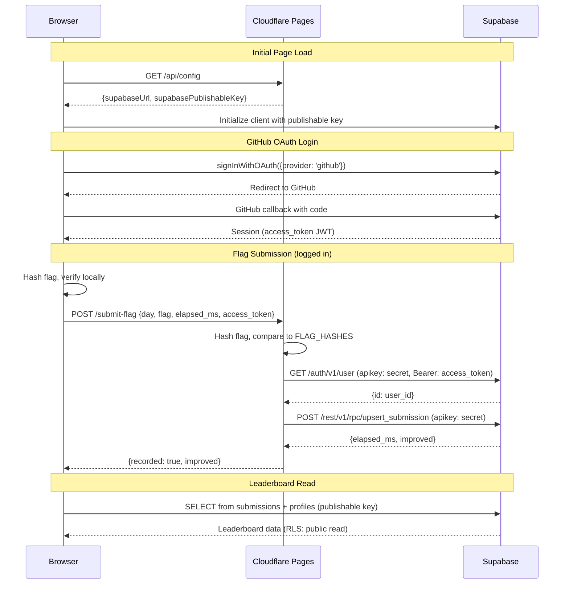

# Advent of Kube

Kubernetes debugging challenges. Solve broken clusters, find flags, compete on the leaderboard.

## How It Works

1. Set up a local Kubernetes cluster with [kind](https://kind.sigs.k8s.io/)
2. Install the challenge Helm chart
3. Debug the cluster — diagnose and fix the issues
4. Find the flag and submit it

## Leaderboard Architecture



## Development

Static SPA deployed on Cloudflare Pages. No build step — vanilla JS modules.

### Environment Variables (Cloudflare Pages)

| Variable | Description |
|----------|-------------|
| `SUPABASE_URL` | Supabase project URL |
| `SUPABASE_PUBLISHABLE_KEY` | Public key for browser client |
| `SUPABASE_SECRET_KEY` | Secret key for server-side functions (encrypt) |

### Project Structure

```
├── index.html              # SPA shell
├── css/style.css           # All styles
├── js/
│   ├── app.js              # Router + auth header
│   ├── router.js           # SPA router (History API)
│   ├── config.js           # Day definitions + flag hashes
│   ├── supabase.js         # Supabase client + auth helpers
│   ├── leaderboard.js      # Leaderboard widget
│   └── pages/
│       ├── landing.js      # Home page + calendar
│       ├── calendar.js     # Standalone calendar
│       └── day.js          # Challenge page
├── functions/              # Cloudflare Pages Functions
│   ├── api/config.js       # Serves public Supabase config
│   └── submit-flag.js      # Server-side flag validation
└── charts/                 # Helm charts for each day
    └── day00/, day01/, ...
```
