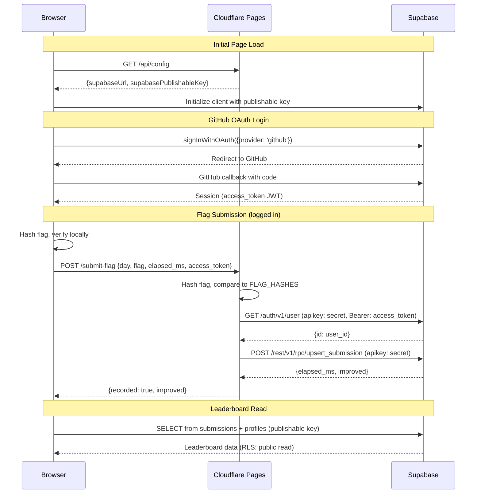

# Advent of Kube

<p align="center">
  
</p>

<p align="center">
  <strong>Kubernetes debugging challenges. Solve broken clusters, find flags, compete on the leaderboard.</strong>
</p>

<p align="center">
  <a href="https://adventofkube.com">Play Now</a>
</p>

---

## How It Works

1. Set up a local Kubernetes cluster with [kind](https://kind.sigs.k8s.io/)
2. Install the challenge Helm chart
3. Debug the cluster — diagnose and fix the issues
4. Find the flag and submit it

---

## Challenge Roadmap

25 days of challenges progressing from beginner to expert, covering core Kubernetes and real-world DevOps tooling.

### Beginner (Days 0-5) — "I'm learning Kubernetes"
| Day | Title | Topic | Status |
|-----|-------|-------|--------|
| 0 | Setup | Environment | Done |
| 1 | Broken Pod | Pods, Images | Done |
| 2 | Missing ConfigMap | ConfigMaps | Done |
| 3 | Label Mismatch | Labels, Selectors | Done |
| 4 | Secret Rotation | Secrets | Done |
| 5 | Resource Squeeze | Resources | Done |

### Intermediate (Days 6-12) — "I work with Kubernetes"
| Day | Title | Topic | Status |
|-----|-------|-------|--------|
| 6 | Broken Deployment | Deployments | Done |
| 7 | Service Wiring | Services | Ready |
| 8 | Probe Pitfall | Probes | Ready |
| 9 | RBAC Lockdown | RBAC | Ready |
| 10 | NetworkPolicy Firewall | NetworkPolicies | Ready |
| 11 | PV/PVC Binding | Storage | Ready |
| 12 | Rolling Update Stuck | Rollouts | Ready |

### Advanced (Days 13-20) — "I run production clusters"
| Day | Title | Topic | Status |
|-----|-------|-------|--------|
| 13 | Metrics Missing | Prometheus ServiceMonitor | Ready |
| 14 | Dashboard Down | Grafana Datasource | Ready |
| 15 | Alerts Silent | AlertManager Routing | Ready |
| 16 | Logs Lost | Loki / Promtail Scrape | Ready |
| 17 | Pipeline Mismatch | Promtail Pipeline | Ready |
| 18 | Stuck Pending | Node Affinity | Ready |
| 19 | Ingress + TLS | Ingress, cert-manager | Ready |
| 20 | HPA Not Scaling | Autoscaling | Ready |

### Expert (Days 21-25) — "I'm an SRE/Platform Engineer"
| Day | Title | Topic | Status |
|-----|-------|-------|--------|
| 21 | GitOps Drift | ArgoCD Application | Ready |
| 22 | Sync Sabotage | ArgoCD Sync Hooks | Ready |
| 23 | Policy Blocked | Kyverno | Ready |
| 24 | Webhook Woes | Admission Webhooks | Ready |
| 25 | Grand Finale | Everything | Ready |

### Tools by Difficulty

| Days | Tools Required |
|------|----------------|
| 0-12 | kind, kubectl, helm |
| 13-17 | + Prometheus, Grafana, Loki, Promtail |
| 18-20 | + cert-manager, metrics-server |
| 21-22 | + ArgoCD |
| 23 | + Kyverno |
| 24-25 | + Webhook infrastructure |

---

## Architecture



---

## Tech Stack

- **Frontend**: Vanilla JS (no build step), CSS
- **Hosting**: Cloudflare Pages + Functions
- **Auth & Database**: Supabase (Postgres + GitHub OAuth)
- **Challenges**: Helm charts + custom container images on GHCR

### Project Structure

```
├── index.html              # SPA shell
├── css/style.css           # All styles
├── js/
│   ├── app.js              # Router + auth header
│   ├── router.js           # SPA router (History API)
│   ├── config.js           # Day definitions + flag hashes
│   ├── supabase.js         # Supabase client + auth helpers
│   ├── leaderboard.js      # Leaderboard widget
│   └── pages/
│       ├── landing.js      # Home page + calendar
│       ├── calendar.js     # Standalone calendar
│       └── day.js          # Challenge page
├── functions/              # Cloudflare Pages Functions
│   ├── api/config.js       # Serves public Supabase config
│   └── submit-flag.js      # Server-side flag validation
├── charts/                 # Helm charts for each day
│   └── day00/, day01/, ...
└── images/                 # Container image sources
    └── day01/, day03/, ...
```

---

## Design Decisions

Key architectural choices and the reasoning behind them. Update this section as the project evolves.

### Frontend: Vanilla JS, No Framework
The UI is mostly static content (challenge descriptions, hints, a flag input). A framework would add build complexity for near-zero benefit. The custom 60-line SPA router handles `/day/:n` patterns, and Cloudflare's `_redirects` serves `index.html` for all paths.

### Hosting: Cloudflare Pages + Functions
The app has ~90 lines of server-side code total (flag validation + config endpoint). Cloudflare Pages bundles free static hosting with serverless functions in one deploy — no separate backend to maintain or pay for.

### Backend: Supabase as BaaS
Supabase provides GitHub OAuth, a Postgres database, and auto-generated REST APIs. The browser queries tables directly using the publishable key (filtered by Row-Level Security). The `upsert_submission` RPC lives in Postgres. Trade-off: the DB schema is effectively a public API, and RLS policies aren't version-controlled in the repo.

### Flag System: Inject at Build, Verify at Submit
Each Go binary reads its flag from an environment variable (`FLAG`) set in the Helm chart's `values.yaml`. The flag follows the format `AOK{...}` and is printed to stdout (or served via HTTP) when the pod runs correctly. Flag hashes (SHA-256) are stored in `config.js` and `functions/submit-flag.js` — the browser hashes the user's input for instant UI feedback, then the Cloudflare Function re-hashes server-side before recording to the leaderboard. The hashes are technically visible in source, but reversing SHA-256 isn't practical and the flag space provides sufficient friction for a learning platform.

### Progress: localStorage-First, Optional Auth
Completion state lives in `localStorage` so users can track progress without signing in. Auth (GitHub OAuth via Supabase) is only required for the leaderboard. On login, `syncProgressFromServer()` pulls server submissions into localStorage.

### Local Clusters: kind Over Minikube
`kind` only needs Docker (no VM hypervisor), is lighter weight, and is what the Kubernetes project itself uses for testing. Zero cloud cost per user — everything runs on their machine.

### Chart Distribution: Helm OCI on GHCR
Charts are pushed to `oci://ghcr.io/adventofkube/charts/dayNN` alongside container images. Avoids maintaining a separate Helm chart repository (`index.yaml` over HTTP). One registry for everything.

### Container Images: Go + Scratch Base
Static Go binaries in `scratch` (empty) images. No shell means users can't `kubectl exec` into containers — they're forced to debug externally with `kubectl describe`, `logs`, and `get -o yaml`. The constraint is the curriculum.

### Challenge Bugs: In values.yaml, Not Templates
Helm templates are correct; bugs are injected through `values.yaml` (typos, wrong references, missing selectors). Users debug live Kubernetes objects with `kubectl`, not Helm source. Keeps challenges focused on K8s debugging skills.

### CI: Diff-Based Builds
GitHub Actions detects changed `images/` or `charts/` directories via `git diff HEAD~1` and only builds those. Manual `workflow_dispatch` covers rebuilds. Avoids rebuilding all 25 days for a single chart change.

---

## Contributing

This is a personal project, but if you have ideas for challenges or find bugs, feel free to open an issue.

---

## License

All rights reserved. You may view the source code but not redistribute or create derivative works without permission.
