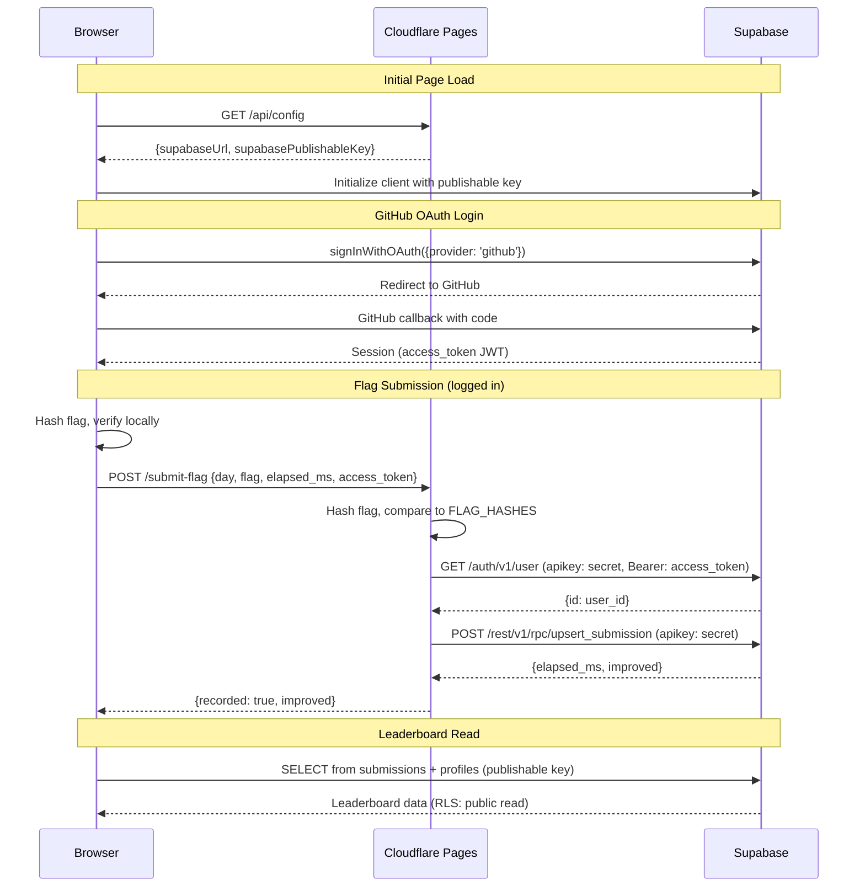

# Advent of Kube

<p align="center">
  
</p>

<p align="center">
  <strong>Kubernetes debugging challenges. Solve broken clusters, find flags, compete on the leaderboard.</strong>
</p>

<p align="center">
  <a href="https://adventofkube.com">Play Now</a>
</p>

---

## How It Works

1. Set up a local Kubernetes cluster with [kind](https://kind.sigs.k8s.io/)
2. Install the challenge Helm chart
3. Debug the cluster — diagnose and fix the issues
4. Find the flag and submit it

---

## Challenge Roadmap

25 days of challenges progressing from beginner to expert, covering core Kubernetes and real-world DevOps tooling.

### Beginner (Days 0-5) — "I'm learning Kubernetes"
| Day | Title | Topic | Status |
|-----|-------|-------|--------|
| 0 | Setup | Environment | ✅ |
| 1 | Broken Pod | Pods, Images | ✅ |
| 2 | CrashLoop Detective | ConfigMaps | ✅ |
| 3 | Label Mismatch | Labels, Selectors | ✅ |
| 4 | Secret Rotation | Secrets | ✅ |
| 5 | Resource Squeeze | Resources | 🚧 |

### Intermediate (Days 6-12) — "I work with Kubernetes"
| Day | Title | Topic | Status |
|-----|-------|-------|--------|
| 6 | Broken Deployment | Deployments | 🚧 |
| 7 | Service Wiring | Services | |
| 8 | Probe Pitfall | Probes | |
| 9 | RBAC Lockdown | RBAC | |
| 10 | NetworkPolicy Firewall | NetworkPolicies | |
| 11 | PV/PVC Binding | Storage | |
| 12 | Rolling Update Stuck | Rollouts | |

### Advanced (Days 13-19) — "I run production clusters"
| Day | Title | Topic | Status |
|-----|-------|-------|--------|
| 13 | Metrics Missing | Prometheus | |
| 14 | Dashboard Down | Grafana | |
| 15 | Logs Lost | Loki | |
| 16 | Ingress + TLS | Ingress, cert-manager | |
| 17 | HPA Not Scaling | Autoscaling | |
| 18 | Node Affinity | Scheduling | |
| 19 | Taint Toleration | Scheduling | |

### Expert (Days 20-25) — "I'm an SRE/Platform Engineer"
| Day | Title | Topic | Status |
|-----|-------|-------|--------|
| 20 | GitOps Drift | ArgoCD | |
| 21 | Policy Blocked | Kyverno/OPA | |
| 22 | Init Container Chain | Init Containers | |
| 23 | Ephemeral Debug | Debugging | |
| 24 | Webhook Woes | Admission Webhooks | |
| 25 | Grand Finale | Everything | |

### Tools by Difficulty

| Days | Tools Required |
|------|----------------|
| 0-12 | kind, kubectl, helm |
| 13-15 | + Prometheus, Grafana, Loki |
| 16-17 | + cert-manager, metrics-server |
| 20+ | + ArgoCD, Kyverno |

---

## Architecture



---

## Tech Stack

- **Frontend**: Vanilla JS (no build step), CSS
- **Hosting**: Cloudflare Pages + Functions
- **Auth & Database**: Supabase (Postgres + GitHub OAuth)
- **Challenges**: Helm charts + custom container images on GHCR

### Project Structure

```
├── index.html              # SPA shell
├── css/style.css           # All styles
├── js/
│   ├── app.js              # Router + auth header
│   ├── router.js           # SPA router (History API)
│   ├── config.js           # Day definitions + flag hashes
│   ├── supabase.js         # Supabase client + auth helpers
│   ├── leaderboard.js      # Leaderboard widget
│   └── pages/
│       ├── landing.js      # Home page + calendar
│       ├── calendar.js     # Standalone calendar
│       └── day.js          # Challenge page
├── functions/              # Cloudflare Pages Functions
│   ├── api/config.js       # Serves public Supabase config
│   └── submit-flag.js      # Server-side flag validation
├── charts/                 # Helm charts for each day
│   └── day00/, day01/, ...
└── images/                 # Container image sources
    └── day01/, day03/, ...
```

---

## Contributing

This is a personal project, but if you have ideas for challenges or find bugs, feel free to open an issue.

---

## License

All rights reserved. You may view the source code but not redistribute or create derivative works without permission.
